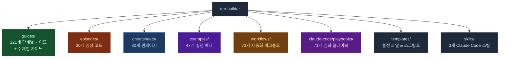
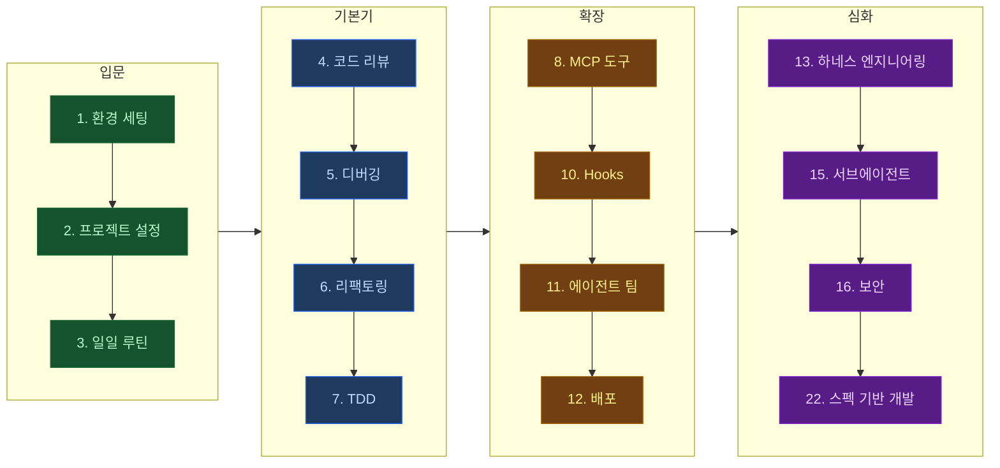

# 텐빌더

> AI로 10배 빠르게 빌드하는 방법을 알려드려요

[](https://maily.so/tenbuilder)
[](https://youtube.com/@ten-builder)

---

실무에서 바로 쓸 수 있는 AI 활용법을 다루고 있어요.

글로벌 IT 회사에서 6년간 2억+ 유저 서비스를 담당했던 엔지니어가,
Claude Code, Gemini 등 AI를 실무에서 직접 써보고 검증한 내용을 공유합니다.

- **직접 써보고 검증한 AI 리뷰**
- **AI를 10배 더 활용할 수 있는 실전 노하우**
- **2억명+ 서비스를 다뤄본 경험의 실전 노하우**

---

## 레포 구조



| 폴더 | 내용 | 난이도 |
|------|------|--------|
| [`/guides`](./guides) | 1~112 단계별 + 주제별 실전 가이드 | ⭐⭐⭐ |
| [`/episodes`](./episodes) | 영상별 코드 & 스크립트 | ⭐⭐ |
| [`/cheatsheets`](./cheatsheets) | 원페이저 치트시트 | ⭐ |
| [`/examples`](./examples) | 프로젝트별 실전 예제 | ⭐⭐ |
| [`/workflows`](./workflows) | CI/CD, Docker, MCP 워크플로 | ⭐⭐⭐ |
| [`/claude-code`](./claude-code) | 플레이북 & 심화 패턴 | ⭐⭐⭐ |
| [`/templates`](./templates) | 복사해서 바로 쓰는 설정 파일 | ⭐ |
| [`/skills`](./skills) | Claude Code 학습 스킬 (퀴즈 + 노트) | ⭐⭐ |

---

## 학습 로드맵



---

## Quick Start

**1분 안에 Claude Code 프로젝트 설정:**

```bash
# CLAUDE.md 템플릿 복사
curl -O https://raw.githubusercontent.com/ten-builder/ten-builder/main/templates/CLAUDE.md.template

# 프로젝트 루트에 배치
mv CLAUDE.md.template CLAUDE.md

# 프로젝트에 맞게 수정 후 사용
```

**AI 코딩 환경 한 번에 세팅:**

```bash
# macOS 원클릭 설정
curl -sSL https://raw.githubusercontent.com/ten-builder/ten-builder/main/templates/macos-setup.sh | bash
```

## 에이전트 팀

> AI 에이전트 5명이 동시에 코딩합니다. tmux로 병렬 실행.

```bash
# 1. 레포 클론
git clone https://github.com/ten-builder/ten-builder.git
cd ten-builder/episodes/ep5-agent-teams-with-tmux

# 2. 미리보기
./run-agent-team.sh prompts --dry

# 3. 실행 (tmux + Claude Code 필요)
./run-agent-team.sh prompts
```

**자세한 가이드:** [에이전트 팀 가이드](./guides/11-agent-teams.md)

📮 **영상에서 사용한 실제 프롬프트 5개는 뉴스레터에서:** [maily.so/tenbuilder](https://maily.so/tenbuilder)

---

## 가이드 목차

### 단계별 가이드

| # | 가이드 | 설명 |
|---|--------|------|
| 1 | [환경 세팅](./guides/1-environment-setup.md) | AI 코딩 도구 설치 & 설정 |
| 2 | [프로젝트 초기 설정](./guides/2-project-setup.md) | CLAUDE.md부터 첫 커밋까지 |
| 3 | [일일 코딩 루틴](./guides/3-daily-workflow.md) | 매일 AI와 코딩하는 워크플로 |
| 4 | [코드 리뷰](./guides/4-code-review.md) | AI 코드 리뷰 & PR 워크플로 |
| 5 | [디버깅](./guides/5-debugging.md) | AI와 체계적으로 버그 잡기 |
| 6 | [리팩토링](./guides/6-refactoring.md) | AI와 안전하게 코드 개선 |
| 7 | [TDD](./guides/7-tdd.md) | AI와 테스트 주도 개발 |
| 8 | [MCP 도구](./guides/8-mcp-tools.md) | 외부 도구 연결 (DB, GitHub 등) |
| 9 | [보안](./guides/9-security.md) | AI 코딩 도구 보안 설정 |
| 10 | [Hooks](./guides/10-hooks.md) | 자동 검사/포맷/알림 설정 |
| 11 | [에이전트 팀](./guides/11-agent-teams.md) | AI 에이전트 5명으로 동시 빌딩 |
| 12 | [배포](./guides/12-deployment.md) | AI와 배포 파이프라인 구축 |
| 13 | [하네스 엔지니어링](./guides/13-harness-engineering.md) | AI 에이전트 실행 환경 설계 |
| 14 | [비용 최적화](./guides/14-cost-optimization.md) | AI 코딩 도구 비용 관리 전략 |
| 15 | [서브에이전트 오케스트레이션](./guides/15-subagent-orchestration.md) | 서브에이전트 분할 & 병렬 실행 전략 |
| 16 | [AI 코딩 보안](./guides/16-ai-coding-security.md) | AI 코딩 보안 위험 & 방어 전략 |
| 17 | [AI 페어 프로그래밍](./guides/17-ai-pair-programming.md) | AI와 효과적인 페어 프로그래밍 |
| 18 | [AI 출력물 검증](./guides/18-ai-output-verification.md) | AI 생성 코드 체계적 검증 방법 |
| 19 | [태스크 분해](./guides/19-task-decomposition.md) | AI 에이전트 태스크 분해 기법 |
| 20 | [에러 복구 전략](./guides/20-error-recovery.md) | AI 코딩 에러 감지 & 복구 전략 |
| 21 | [팀 AI 도입](./guides/21-team-ai-adoption.md) | 팀 단위 AI 도구 도입 전략 |
| 22 | [스펙 기반 AI 개발](./guides/22-spec-driven-ai-development.md) | 스펙 먼저 정의하고 AI에게 맡기기 |
| 23 | [AI 테스팅 전략](./guides/23-ai-testing-strategy.md) | AI와 테스트 전략 수립 & 자동화 |
| 24 | [프롬프트 캐싱 최적화](./guides/24-prompt-caching-optimization.md) | 프롬프트 캐싱으로 비용 & 속도 개선 |
| 25 | [Background Agent 워크플로](./guides/25-background-agent-workflow.md) | Background Agent & Worktree 병렬 개발 |
| 26 | [멀티 AI 도구 조합](./guides/26-multi-tool-ai-workflow.md) | 여러 AI 코딩 도구 조합 워크플로 |
| 27 | [AI 에이전트 샌드박싱](./guides/27-ai-agent-sandboxing.md) | AI 에이전트 격리 환경 구축 |
| 28 | [AI 코딩 ROI 측정](./guides/28-ai-coding-roi-measurement.md) | AI 코딩 도구 투자 수익 측정 |
| 29 | [AI 에이전트 옵저버빌리티](./guides/29-ai-agent-observability.md) | AI 에이전트 모니터링 & 로깅 |
| 30 | [Skills 아키텍처](./guides/30-ai-coding-skills-architecture.md) | Claude Code Skills 설계 & 관리 |
| 31 | [컨텍스트 엔지니어링](./guides/31-context-engineering.md) | AI 에이전트 컨텍스트 최적화 기법 |
| 32 | [에이전트 평가 프레임워크](./guides/32-ai-agent-evaluation-framework.md) | AI 코딩 에이전트 체계적 평가 |
| 33 | [AI 위임 판단](./guides/33-ai-delegation-patterns.md) | AI에 맡길 작업 vs 직접 할 작업 판단 |
| 34 | [벤치마크 해석](./guides/34-ai-benchmark-guide.md) | SWE-bench 등 벤치마크 올바르게 읽기 |
| 35 | [에이전트 스캐폴딩 설계](./guides/35-ai-agent-scaffolding-design.md) | AI 에이전트 프레임워크 설계 |
| 36 | [바이브 코딩 마스터](./guides/36-vibe-coding-mastery.md) | 자연어로 소프트웨어를 만드는 실전 패턴 |
| 37 | [멀티모달 AI 코딩](./guides/37-multimodal-ai-coding.md) | 스크린샷으로 UI 생성 & 디버깅 |
| 38 | [AI 코드 보안 거버넌스](./guides/38-ai-code-security-governance.md) | AI 생성 코드 보안 검증 & 거버넌스 |
| 39 | [AI 코딩 워크스테이션](./guides/39-ai-coding-workstation.md) | 터미널+IDE+CLI 통합 개발 환경 |
| 40 | [멀티 에이전트 오케스트레이션](./guides/40-multi-agent-orchestration.md) | 여러 AI 에이전트 동시 운영 패턴 |
| 41 | [AI 에이전트 트러블슈팅](./guides/41-ai-agent-troubleshooting.md) | AI 에이전트 문제 해결 7가지 패턴 |
| 42 | [AI 벤치마크 실전 측정](./guides/42-ai-coding-benchmark-practice.md) | SWE-bench 직접 돌려보고 에이전트 선택 |
| 43 | [LLM 코딩 워크플로우 최적화](./guides/43-llm-coding-workflow-optimization.md) | 스펙→생성→검증→커밋 실전 루프 |
| 44 | [1M 컨텍스트 윈도우 전략](./guides/44-1m-context-window-strategy.md) | 대규모 컨텍스트 윈도우 실전 활용법 |
| 45 | [AI 코딩 데이터 프라이버시](./guides/45-ai-coding-data-privacy.md) | AI 코딩 도구 데이터 프라이버시 관리 |
| 46 | [백그라운드 코딩 에이전트](./guides/46-background-coding-agents.md) | 백그라운드에서 작업하는 AI 코딩 에이전트 |
| 47 | [추론 모델 코딩 활용](./guides/47-reasoning-models-coding.md) | 추론 모델을 코딩에 활용하는 전략 |
| 48 | [Git Worktree AI 병렬 개발](./guides/48-git-worktree-ai-parallel-dev.md) | Git Worktree로 AI 에이전트 병렬 개발 |
| 49 | [AI PR 영향 범위 분석](./guides/49-ai-pr-blast-radius.md) | AI PR의 Blast Radius 자동 평가 & 리스크 점수 |
| 49 | [AI + TDD 워크플로](./guides/49-ai-tdd-workflow.md) | AI 시대의 Red-Green-Refactor 실전 적용 |
| 50 | [프롬프트 체이닝 고급 패턴](./guides/50-advanced-prompt-chaining-patterns.md) | 복잡한 태스크를 프롬프트 체인으로 분해 |
| 51 | [터미널 AI 코딩 에이전트 비교 2026](./guides/51-terminal-ai-agents-comparison-2026.md) | 터미널 기반 AI 코딩 에이전트 실전 비교 |
| 52 | [커스텀 룰 파일 설계](./guides/52-custom-rules-file-design.md) | AI 에이전트 룰 파일 프로젝트 규모별 설계 |
| 53 | [백그라운드 에이전트 실행](./guides/53-background-agent-execution.md) | 비동기 AI 에이전트 실행 & 자동화 패턴 |
| 54 | [데이터 기반 AI 도구 선택](./guides/54-data-driven-ai-tool-selection.md) | 실사용 데이터 기반 AI 코딩 도구 선택 가이드 |
| 55 | [바이브 코딩 함정 피하기](./guides/55-vibe-coding-pitfalls-and-safety.md) | 실제 프로덕션 사례로 배우는 안전한 AI 코딩 |
| 56 | [Claude Code 서브에이전트 병렬 실행 심화](./guides/56-claude-code-subagent-parallel-guide.md) | 서브에이전트 최대 7개 동시 실행, Plan Mode, 독립 체크아웃 패턴 |
| 57 | [Gemini CLI 실전 가이드 2026](./guides/57-gemini-cli-practical-guide-2026.md) | 설치부터 고급 코딩 워크플로우까지 — 대규모 코드베이스 분석, 멀티모달 입력, MCP 통합 |
| 58 | [오케스트레이터-워커 패턴 심화 가이드](./guides/58-ai-agent-orchestrator-patterns.md) | 단일 에이전트 한계를 넘어 여러 AI 에이전트를 조율하는 실전 가이드 |
| 59 | [AI 코딩 도구 ROI 측정 실전 가이드](./guides/59-ai-coding-roi-measurement.md) | 허수 지표 없이 실제 생산성 변화를 측정하는 방법 — DORA 지표, 리드타임, 결함율, ROI 계산 예시 |
| 60 | [Kiro IDE 실전 가이드](./guides/60-kiro-ide-practical-guide.md) | Amazon Kiro 스펙 주도 워크플로우, Agent Hooks, Steering Files 완전 가이드 — Claude Code와 차이점 비교 |
| 61 | [AI 에이전트 결과물 검수 패턴](./guides/61-ai-agent-output-review-patterns.md) | AI 에이전트 출력 체계적 검수 & Human-in-the-Loop 패턴 |
| 62 | [멀티 모델 교차 검증 워크플로우](./guides/62-multi-model-adversarial-review.md) | Claude Code 작성 + Gemini CLI 리뷰 — 고위험 코드 검증 가이드 |
| 63 | [컨텍스트 엔지니어링](./guides/63-context-engineering-2026.md) | AI 에이전트 성능의 90%를 결정하는 컨텍스트 설계 — 5가지 레이어, 실전 패턴 |
| 64 | [GitHub Copilot 팀 맞춤 설정](./guides/64-github-copilot-customization-guide.md) | 커스텀 지시사항 & 익스텐션으로 팀 특화 AI 코딩 환경 구성 |
| 65 | [Windsurf IDE 실전 가이드 2026](./guides/65-windsurf-ide-practical-guide.md) | Cascade 에이전트 기반 흐름형 AI 코딩 — 설치, 패턴, Cursor/Claude Code 비교 |
| 66 | [Amazon Q Developer CLI 실전 가이드 2026](./guides/66-amazon-q-developer-cli-guide.md) | AWS 네이티브 통합, IaC 코드 생성, 보안 스캔, 대화 저장/재개 — AWS 환경 AI 에이전트 |
| 67 | [AI PR 리뷰 자동화 가이드 2026](./guides/67-ai-pr-review-automation-guide.md) | PR 대기 시간을 줄이는 AI 리뷰 자동화 — GitHub Actions 파이프라인 구축 |
| 68 | [Junie CLI 실전 가이드 2026](./guides/68-junie-cli-practical-guide-2026.md) | JetBrains 터미널 AI 에이전트 — IDE 연동, 모델 선택, 자율 실행 패턴 |
| 69 | [Claude Agent SDK & 장기 실행 에이전트 실전 가이드 2026](./guides/69-claude-agent-sdk-long-running-guide.md) | 장시간 자율 실행, Hooks 3가지 유형, 서브에이전트 컨텍스트 격리 패턴 |
| 70 | [AI 에이전트 품질 저하 감지법](./guides/70-ai-agent-quality-degradation-detection.md) | Claude Code 사후 분석으로 배우는 AI 에이전트 신뢰성 설계 |
| 71 | [Claude Code Agent Teams GA 실전 가이드](./guides/71-claude-code-agent-teams-ga-guide.md) | 정식 출시된 Agent Teams — AI 팀과 협업하는 새로운 개발 방식 |
| 72 | [AI 에이전트 팀 구성 가이드](./guides/72-ai-coding-agent-team-composition-guide.md) | 역할 분담으로 복잡한 기능 완성하기 — 플래너, 아키텍트, 구현자, 테스터 |
| 73 | [Cursor IDE 실전 가이드 2026](./guides/73-cursor-ide-practical-guide-2026.md) | Background Agents, Notepads, .cursorrules, Composer 완전 정복 |
| 74 | [Zed IDE 실전 가이드 2026](./guides/74-zed-ide-practical-guide-2026.md) | ACP로 AI 에이전트 팀 구성하기 — Rust 기반 초고속 에디터의 새로운 정체성 |
| 75 | [React Native + Expo AI 에이전트 개발 가이드 2026](./guides/75-react-native-mobile-ai-agent-guide.md) | Expo Skills 연동, 컴포넌트 개발, 네이티브 기능 통합, E2E 테스트 자동화 |
| 76 | [AI 에이전트 코드 리팩토링 가이드 2026](./guides/76-ai-agent-refactoring-guide-2026.md) | 기술 부채 우선순위, 안전한 리팩토링 패턴, 테스트 커버리지 확보, 팀 합의 프로세스 |
| 77 | [Claude Code Week 17 실전 가이드](./guides/77-claude-code-week17-features-guide.md) | 커스텀 테마, /team-onboarding 커맨드, UI 개편, 기업 CA 인증서 자동 신뢰 |
| 78 | [Claude Code Remote Control + Dispatch 실전 가이드](./guides/78-claude-code-remote-dispatch-guide.md) | 여러 머신에서 AI 에이전트를 원격 조율하는 분산 에이전트 배포, 네트워크 격리, 태스크 라우팅 |
| 79 | [Claude Code Week 18 실전 가이드](./guides/79-claude-code-week18-features-guide.md) | ultraplan 자동 클라우드, /resume, /model 영속화, 포크 서브에이전트 |
| 80 | [스펙-퍼스트 개발 실전 가이드 2026](./guides/80-spec-first-ai-workflow-guide.md) | 코드 전에 AI와 함께 설계하는 4단계 워크플로우 — CLAUDE.md 규칙, 스펙-구현 검증, 팀 도입 전략 |
| 81 | [Claude Code Week 19 실전 가이드](./guides/81-claude-code-week19-features-guide.md) | alwaysLoad MCP, PostToolUse Hooks, 동적 비주얼 — Week 19 신기능 실전 적용법 |
| 82 | [Next.js + Vercel AI SDK 풀스택 AI 앱 개발 가이드 2026](./guides/82-nextjs-vercel-ai-sdk-guide-2026.md) | useChat, streamText, generateObject로 실시간 스트리밍 AI 앱을 처음부터 배포까지 |
| 83 | [Claude Code Week 20 실전 가이드](./guides/83-claude-code-week20-features-guide.md) | project purge, SSH OAuth, --channels 권한 중계 — v2.1.126~v2.1.128 핵심 업데이트 |
| 84 | [Claude Code Week 21 실전 가이드](./guides/84-claude-code-week21-features-guide.md) | 스크롤 다이얼로그, Fork 서브에이전트, OpenTelemetry 스킬 이벤트 — v2.1.128+ 신기능 |
| 85 | [Google Antigravity IDE 실전 가이드 2026](./guides/85-google-antigravity-ide-practical-guide-2026.md) | Agent Manager로 병렬 에이전트 개발 — 설치, Manager/Editor View, Gemini 3 Pro 연동 |
| 86 | [Claude Code Week 22 실전 가이드](./guides/86-claude-code-week22-features-guide.md) | 세션 환경변수, 플러그인 URL 로딩, 터미널 UX 개선 — v2.1.129~v2.1.132 총정리 |
| 87 | [Claude Code 데스크탑 앱 재설계 실전 가이드](./guides/87-claude-code-desktop-redesign-guide.md) | 세션 사이드바와 병렬 에이전트 관리 — 드래그 앤 드롭, 통합 터미널, SSH 지원 |
| 88 | [Codex CLI /goal 모드 실전 가이드 2026](./guides/88-codex-cli-goal-mode-guide.md) | /goal로 Plan→Act→Test→Review 자율 반복 — Budget Awareness, MCP 연동, Skills 패턴 |
| 89 | [Claude Code vs GitHub Copilot 2026 완전 비교](./guides/89-claude-code-vs-github-copilot-2026.md) | 터미널 에이전트 vs IDE 코파일럿 — 기능, 비용, 워크플로우, 팀 도입 기준 비교 |
| 90 | [Claude Code Week 23 실전 가이드](./guides/90-claude-code-week23-features-guide.md) | /powerup 대화형 레슨, worktree.baseRef 설정, 레이트 리밋 2배 — v2.1.133~v2.1.138 |
| 91 | [Git Worktree 기반 병렬 에이전트 실전 가이드 2026](./guides/91-git-worktree-parallel-agents-guide.md) | baseRef 설정, 서브에이전트 격리 전략, 충돌 없는 병렬 작업, 워크트리 정리 |
| 92 | [AI 에이전트 스킬 시스템 실전 가이드 2026](./guides/92-ai-agent-skills-guide-2026.md) | 에이전트 역량 모듈화, 스킬 설계 원칙, 재사용 가능한 컴포넌트 패턴 |
| 93 | [Claude Code Routines + Dreaming + Outcomes 실전 가이드 2026](./guides/93-claude-code-routines-dreaming-outcomes-guide.md) | 스케줄 기반 자동화, 에이전트 자기 개선 루프, rubric 기반 품질 검증 |
| 94 | [에이전틱 워크플로우 설계 패턴 실전 가이드](./guides/94-agentic-workflow-design-patterns-guide.md) | 오케스트레이터-워커, 병렬 탐색, 반성 루프, 평가자-최적화 — 6가지 패턴과 Claude Code 실전 적용법 |
| 95 | [Hermes Agent 실전 가이드 2026](./guides/95-hermes-agent-practical-guide-2026.md) | NousResearch 오픈소스 자기 개선 AI 에이전트 — 설치, Skills 시스템, Claude Code 비교 |
| 96 | [Claude Code Week 24 실전 가이드](./guides/96-claude-code-week24-features-guide.md) | 2026년 5월 11~15일 릴리스 핵심 업데이트 — v2.1.139~v2.1.145 신기능 총정리 |
| 97 | [Ralph Wiggum 패턴 — 단발 프롬프트에서 자율 에이전트 루프로](./guides/97-ralph-wiggum-autonomous-agent-loop.md) | 자율 에이전트 루프 설계, 종료 조건, 에러 복구, CLAUDE.md 패턴 실전 가이드 |
| 98 | [claude agents 디스패치 플래그 실전 가이드 2026](./guides/98-claude-agents-dispatch-flags-guide.md) | --settings, --add-dir, --mcp-config, --plugin-dir, --permission-mode, --model, --effort 플래그로 서브에이전트 환경 일관 제어 |
| 99 | [Claude Code Agent View 실전 가이드 2026](./guides/99-claude-code-agent-view-guide.md) | Agent View 슈퍼바이저 아키텍처, 병렬 에이전트 워크플로우, Peek 패널, 워크트리 자동 격리, settings.autoMode |
| 100 | [Claude Code Week 25 실전 가이드](./guides/100-claude-code-week25-features-guide.md) | /autofix-pr 자동화, Managed Agents 3종 업데이트, 멀티에이전트 세션 관리 — v2.1.146~v2.1.150 |
| 101 | [AI 코딩 에이전트 기업 도입 거버넌스 가이드 2026](./guides/101-enterprise-ai-coding-governance-guide.md) | 도구 승인 프로세스, 코드 리뷰 정책, 데이터 분류, 감사 추적 — 팀 크기별 도입 로드맵 |
| 102 | [Zencoder + ZenFlow 실전 가이드 2026](./guides/102-zencoder-zenflow-practical-guide-2026.md) | 코딩 바깥의 75%를 AI로 자동화 — 플래닝, 코드 리뷰, 보고, 커뮤니케이션, 100+ MCP 도구 연동 |
| 103 | [OpenAI Agents SDK 실전 가이드 2026](./guides/103-openai-agents-sdk-practical-guide-2026.md) | SandboxAgent, 서브에이전트 핸드오프, MCP 1등 지원 — 설치부터 프로덕션 배포까지 |
| 104 | [에이전틱 테스팅 완전 가이드 2026](./guides/104-agentic-testing-automation-guide-2026.md) | AI 에이전트가 커버리지 공백을 찾고 셀프힐링 테스트를 자율 실행하는 새 테스팅 패러다임 |
| 105 | [Code with Claude 2026 신기능 실전 가이드](./guides/105-code-with-claude-2026-agent-features-guide.md) | 관리형 에이전트, Dreaming 자기 개선, Outcomes 품질 검증, Routines 자동화 — 4가지 핵심 신기능 정리 |
| 106 | [Claude Code Week 26 실전 가이드](./guides/106-claude-code-week26-features-guide.md) | 2026년 5월 19~23일 릴리스 핵심 업데이트 — Code with Claude 2026 이후 공개된 신기능 총정리 |
| 107 | [Claude Code Week 27 실전 가이드](./guides/107-claude-code-week27-features-guide.md) | 2026년 5월 21~23일 릴리스 최신 업데이트 총정리 |
| 108 | [Claude Code Week 28 실전 가이드](./guides/108-claude-code-week28-features-guide.md) | 2026년 5월 26~28일 최신 업데이트 — 멀티에이전트 오케스트레이션 개선, 새 API 기능 총정리 |
| 109 | [Cline VS Code AI 코딩 에이전트 실전 가이드 2026](./guides/109-cline-vscode-agent-guide-2026.md) | 설치, 멀티 LLM 지원, Plan/Act 모드, MCP 연동, Claude Code 비교 — VS Code 오픈소스 에이전트 완전 가이드 |
| 110 | [Claude Code Week 29 실전 가이드](./guides/110-claude-code-week29-features-guide.md) | 핀 백그라운드 세션 유지, continueOnBlock 훅, /code-review 개편, terminalSequence 알림 총정리 |
| 111 | [Devin 2.0 실전 가이드 2026](./guides/111-devin2-practical-guide-2026.md) | $20/월로 쓰는 자율 AI 소프트웨어 엔지니어 — Interactive Planning, Devin Wiki, Devin Search와 Claude Code 역할 분담 |
| 112 | [AI 코딩 에이전트 자율성 5단계 가이드 2026](./guides/112-ai-coding-agent-autonomy-levels-guide.md) | Swarmia 5단계 자율성 분류 기반 Level 1~5 단계별 실전 사례, 측정 지표, 선택 기준 |
| 113 | [AI 코딩 에이전트 2026 하반기 전망 가이드](./guides/113-ai-coding-2026-h2-outlook-guide.md) | 자율성 레벨 업그레이드, 멀티에이전트 팀, 컨텍스트 엔지니어링 심화, 에이전틱 테스팅, 거버넌스 성숙 5가지 핵심 트렌드 |
| 114 | [LangGraph 멀티에이전트 워크플로우 실전 가이드 2026](./guides/114-langgraph-multi-agent-workflow-guide-2026.md) | 상태 기반 멀티에이전트 설계 — 노드, 엣지, 조건부 라우팅, 서브그래프, Claude API 연동 |
| 115 | [Claude Code Week 30 실전 가이드](./guides/115-claude-code-week30-features-guide.md) | /ultrareview, 웹 버전 재설계, 세션 요약 기능, 커스텀 테마 개선 총정리 |
| 116 | [Google ADK 실전 가이드 2026](./guides/116-google-adk-practical-guide-2026.md) | 오픈소스 멀티에이전트 프레임워크 — 설치, Vertex AI 배포, OpenAI Agents SDK 비교 |
| 117 | [CrewAI 실전 가이드 2026](./guides/117-crewai-multi-agent-practical-guide-2026.md) | 역할 기반 멀티에이전트 설계 — Agents, Tasks, Tools, Flows, FastAPI 래핑 완전 가이드 |
| 118 | [PydanticAI 실전 가이드 2026](./guides/118-pydantic-ai-practical-guide-2026.md) | 타입 안전 에이전트 프레임워크 — RunContext, 구조화된 출력, 멀티에이전트 파이프라인, FastAPI 통합 |
| 119 | [Antigravity CLI 실전 가이드 2026](./guides/119-antigravity-cli-practical-guide-2026.md) | Gemini CLI를 대체하는 Google 터미널 에이전트 — Gemini CLI 마이그레이션, 동적 서브에이전트, Hooks 자동화 |
| 120 | [Warp 2026 실전 가이드](./guides/120-warp-agentic-terminal-practical-guide-2026.md) | 에이전트 모드, 병렬 에이전트, MCP 연동, Claude Code 조합 — 에이전틱 개발 환경으로 진화한 Warp 터미널 완전 정복 |
| 121 | [Augment Intent 실전 가이드 2026](./guides/121-augment-intent-ide-practical-guide-2026.md) | 리빙 스펙 기반 멀티에이전트 개발 워크스페이스 — 코디네이터-스페셜리스트-검증자 3에이전트 구조, git worktree 격리, Cursor/Claude Code/Kiro 역할 분담 |

### 주제별 가이드

| 가이드 | 설명 |
|--------|------|
| [PDF 구조화 & 카드 관리](./guides/pdf-card-management.md) | PDF를 마크다운으로 구조화하고 요약 카드를 관리하는 방법 |
| [A2A + MCP 통합 실전 가이드](./guides/51-a2a-mcp-integration.md) | 에이전트 간 통신(A2A)과 도구 연결(MCP)을 함께 활용하는 실전 패턴 |

## 에피소드별 코드

| EP | 제목 | 코드 |
|----|------|------|
| EP01 | 바이브 코딩의 함정 | [`/episodes/EP01-vibe-coding`](./episodes/EP01-vibe-coding) |
| EP02 | 에이전트 팀 | [`/episodes/EP02-agent-teams`](./episodes/EP02-agent-teams) |
| EP03 | AI 에이전트 A to Z | [`/episodes/EP03-ai-agent-az`](./episodes/EP03-ai-agent-az) |
| EP04 | Claude Desktop MCP | [`/episodes/EP04-claude-desktop-mcp`](./episodes/EP04-claude-desktop-mcp) |
| EP05 | 에이전트 팀즈 with tmux | [`/episodes/EP05-agent-teams-tmux`](./episodes/EP05-agent-teams-tmux) |
| EP06 | Claude Code Hooks | [`/episodes/EP06-claude-code-hooks`](./episodes/EP06-claude-code-hooks) |
| EP07 | AI 자동화 봇 | [`/episodes/EP07-ai-automation-bot`](./episodes/EP07-ai-automation-bot) |
| EP08 | OpenAI Codex 리뷰 | [`/episodes/EP08-openai-codex-review`](./episodes/EP08-openai-codex-review) |
| EP09 | AI 코딩 거버넌스 | [`/episodes/EP09-ai-coding-governance`](./episodes/EP09-ai-coding-governance) |
| EP10 | MCP 서버 직접 만들기 | [`/episodes/EP10-mcp-server-hands-on`](./episodes/EP10-mcp-server-hands-on) |
| EP11 | AI 코딩 도구 구매 가이드 | [`/episodes/EP11-ai-coding-tools-buying-guide`](./episodes/EP11-ai-coding-tools-buying-guide) |
| EP12 | AI 코딩 에이전트 실시간 비용 대시보드 만들기 | [`/episodes/EP12-ai-cost-dashboard-live`](./episodes/EP12-ai-cost-dashboard-live) |
| EP13 | 말로 코딩하기 — AI 에이전트 음성 워크플로우 | [`/episodes/EP13-voice-coding-workflow`](./episodes/EP13-voice-coding-workflow) |
| EP14 | AGENTS.md로 AI 팀 구성하기 | [`/episodes/EP14-agents-md-team-coding`](./episodes/EP14-agents-md-team-coding) |
| EP15 | SWE-Bench 에이전트 직접 만들기 | [`/episodes/EP15-swe-bench-agent-build`](./episodes/EP15-swe-bench-agent-build) |
| EP16 | OpenCode 실전 — 오픈소스 AI 코딩 에이전트 직접 써보기 | [`/episodes/EP16-opencode-live`](./episodes/EP16-opencode-live) |
| EP17 | AI 에이전트로 풀스택 SaaS 48시간 만에 만들기 | [`/episodes/EP17-saas-48h-build`](./episodes/EP17-saas-48h-build) |
| EP18 | AI 에이전트로 Kubernetes 앱 처음부터 배포하기 | [`/episodes/EP18-kubernetes-deploy-live`](./episodes/EP18-kubernetes-deploy-live) |
| EP19 | Google Antigravity로 풀스택 앱 처음부터 만들기 — Agent Manager 실전 | [`/episodes/EP19-antigravity-fullstack`](./episodes/EP19-antigravity-fullstack) |
| EP20 | Claude Code 데스크탑 재설계로 풀스택 병렬 개발하기 | [`/episodes/EP20-claude-code-desktop-parallel`](./episodes/EP20-claude-code-desktop-parallel) |
| EP21 | AI 에이전트 메모리 시스템 라이브 빌드 — Mem0 기반 상태 지속 시스템 | [`/episodes/EP21-ai-agent-memory-live`](./episodes/EP21-ai-agent-memory-live) |
| EP22 | Claude Code로 팀 온보딩 30분 만에 끝내기 — /powerup, AGENTS.md 팀 설정 | [`/episodes/EP22-team-onboarding-live`](./episodes/EP22-team-onboarding-live) |
| EP23 | Zencoder ZenFlow로 스펙 주도 개발 실전 — 플래닝부터 배포까지 | [`/episodes/EP23-zenflow-spec-driven-live`](./episodes/EP23-zenflow-spec-driven-live) |
| EP24 | OpenAI Agents SDK로 자율 코드 리뷰 봇 만들기 — SandboxAgent와 핸드오프로 PR 품질 자동 검증 | [`/episodes/EP24-openai-agents-sdk-review-bot`](./episodes/EP24-openai-agents-sdk-review-bot) |
| EP25 | 에이전틱 AI 보안 실전 — OWASP 취약점 공격과 방어 라이브 코딩 | [`/episodes/EP25-agentic-ai-security-live`](./episodes/EP25-agentic-ai-security-live) |
| EP26 | AI 에이전트로 실시간 스트리밍 앱 만들기 — WebSocket + Redis | [`/episodes/EP26-realtime-streaming-app`](./episodes/EP26-realtime-streaming-app) |
| EP27 | AI 에이전트로 Rust 백엔드 처음부터 만들기 — Axum 실전 | [`/episodes/EP27-rust-axum-backend-live`](./episodes/EP27-rust-axum-backend-live) |
| EP28 | AI 에이전트 팀으로 SaaS 대시보드 빌드하기 — 멀티에이전트 협업 실전 | [`/episodes/EP28-multi-agent-saas-dashboard`](./episodes/EP28-multi-agent-saas-dashboard) |
| EP29 | Cline + Claude API로 풀스택 앱 처음부터 만들기 — VS Code 에이전트 실전 | [`/episodes/EP29-cline-fullstack-live`](./episodes/EP29-cline-fullstack-live) |
| EP30 | MCP 서버 10개 실시간 연동 — GitHub, Linear, Slack, Sentry 완전 통합 | [`/episodes/EP30-mcp-server-setup-live`](./episodes/EP30-mcp-server-setup-live) |

## 치트시트

| 치트시트 | 설명 |
|----------|------|
| [AI 코딩 기본](./cheatsheets/ai-coding-cheatsheet.md) | AI 코딩 핵심 명령어 모음 |
| [에이전틱 코딩](./cheatsheets/agentic-coding-cheatsheet.md) | 에이전트 기반 코딩 패턴 |
| [프롬프트 엔지니어링](./cheatsheets/prompt-engineering-cheatsheet.md) | 효과적인 프롬프트 작성법 |
| [AI 프롬프트 라이브러리](./cheatsheets/ai-prompt-library-cheatsheet.md) | 팀 재사용 프롬프트 템플릿 모음 |
| [Claude Code Hooks](./cheatsheets/claude-code-hooks-cheatsheet.md) | Hooks 설정 & 패턴 |
| [Claude Code 커맨드](./cheatsheets/claude-code-commands-cheatsheet.md) | 커스텀 슬래시 커맨드 가이드 |
| [Claude Code 고급 패턴](./cheatsheets/claude-code-advanced-patterns.md) | 멀티 파일 편집, 컨텍스트 관리 고급 팁 |
| [MCP 레퍼런스](./cheatsheets/mcp-quick-reference.md) | MCP 서버 빠른 참조 |
| [MCP 생태계](./cheatsheets/mcp-ecosystem-cheatsheet.md) | MCP 서버 생태계 주요 도구 모음 |
| [MCP 컨텍스트 최적화](./cheatsheets/mcp-context-optimization-cheatsheet.md) | MCP 컨텍스트 윈도우 활용 전략 |
| [토큰 최적화](./cheatsheets/token-optimization-cheatsheet.md) | 토큰 사용량 절약 팁 |
| [AI 모델 라우팅](./cheatsheets/ai-model-routing-cheatsheet.md) | AI 모델별 최적 라우팅 전략 |
| [AI 코딩 비용 최적화](./cheatsheets/ai-coding-cost-optimization-cheatsheet.md) | AI 코딩 도구 비용 절감 실전 팁 |
| [하네스 엔지니어링](./cheatsheets/harness-engineering-cheatsheet.md) | Model/Harness/Surfaces 구조 요약 |
| [서브에이전트 오케스트레이션](./cheatsheets/subagent-orchestration-cheatsheet.md) | 서브에이전트 분할 & 위임 패턴 |
| [에이전트 모드 비교](./cheatsheets/agent-mode-comparison-cheatsheet.md) | AI 에이전트 모드 기능 비교 |
| [AI CLI 도구 비교](./cheatsheets/ai-cli-tools-comparison.md) | Claude Code vs Codex CLI vs Gemini CLI |
| [CLI 코딩 에이전트 비교](./cheatsheets/cli-coding-agents-comparison.md) | 터미널 기반 AI 코딩 에이전트 15종 비교 |
| [AI 코드 리뷰 프롬프트](./cheatsheets/ai-code-review-prompt-cheatsheet.md) | 코드 리뷰 프롬프트 패턴 모음 |
| [AI 에이전트 디버깅](./cheatsheets/ai-agent-debugging-cheatsheet.md) | AI 에이전트 문제 해결 치트시트 |
| [AI 코딩 프라이버시 설정](./cheatsheets/ai-coding-privacy-settings-cheatsheet.md) | AI 코딩 도구별 프라이버시 설정 가이드 |
| [Git + AI 워크플로우](./cheatsheets/git-ai-workflow-cheatsheet.md) | Git + AI 브랜치/커밋 패턴 |
| [Git Worktree](./cheatsheets/git-worktree-cheatsheet.md) | Git Worktree 병렬 개발 패턴 |
| [추론 모델 활용](./cheatsheets/reasoning-model-cheatsheet.md) | 추론 모델 코딩 활용 패턴 |
| [Cursor AI](./cheatsheets/cursor-ai-cheatsheet.md) | Cursor AI IDE 핵심 기능 & 단축키 |
| [GitHub Copilot](./cheatsheets/github-copilot-cheatsheet.md) | GitHub Copilot 필수 기능 & 활용 패턴 |
| [Windsurf](./cheatsheets/windsurf-cheatsheet.md) | Windsurf AI IDE 가이드 |
| [Gemini CLI](./cheatsheets/gemini-cli-cheatsheet.md) | Google Gemini CLI 핵심 기능 & 활용법 |
| [에이전틱 IDE 비교](./cheatsheets/agentic-ide-comparison-cheatsheet.md) | Kiro, Cursor, Claude Code, Antigravity 비교 |
| [Kiro IDE](./cheatsheets/kiro-ide-cheatsheet.md) | AWS Kiro 스펙 기반 에이전틱 IDE |
| [OpenCode](./cheatsheets/opencode-cheatsheet.md) | 오픈소스 AI 코딩 에이전트 가이드 |
| [Cline](./cheatsheets/cline-cheatsheet.md) | 오픈소스 VS Code AI 코딩 에이전트 |
| [Aider](./cheatsheets/aider-cheatsheet.md) | Git 네이티브 터미널 AI 코딩 에이전트 |
| [Devin AI](./cheatsheets/devin-ai-cheatsheet.md) | Cognition Devin 2.0 AI 소프트웨어 엔지니어 |
| [Hermes Agent](./cheatsheets/hermes-agent-cheatsheet.md) | NousResearch Hermes Agent CLI, TUI, Skills, Docker 핵심 명령어 |
| [AI 에이전트 Anti-Patterns 2026](./cheatsheets/ai-agent-anti-patterns-cheatsheet-2026.md) | 프롬프트 터널링, 유령 컨텍스트 등 7가지 반패턴과 올바른 대안 |
| [AI 에이전트 디버깅 플로우](./cheatsheets/ai-agent-debug-flow-cheatsheet.md) | AI 에이전트 에러 5단계 디버깅 플로우 |
| [2026 AI 코드 리뷰 도구 비교](./cheatsheets/ai-code-review-tools-2026.md) | AI 코드 리뷰 도구 기능/가격 비교 |
| [MCP 프로덕션 보안](./cheatsheets/mcp-production-security-cheatsheet.md) | MCP 서버 프로덕션 보안 운영 체크리스트 |
| [AI 에이전트 보안 위협 대응](./cheatsheets/ai-agent-security-threat-response.md) | AI 코딩 보안 위협 실전 대응 체크리스트 |
| [AI 에이전트 평가 프레임워크](./cheatsheets/ai-agent-evaluation-framework-cheatsheet.md) | AI 코딩 에이전트 정량 평가 기준 — SWE-bench, 완료율, 토큰 효율 |
| [A2A + MCP 프로토콜 통합](./cheatsheets/a2a-mcp-protocol-cheatsheet.md) | A2A(에이전트 간) + MCP(에이전트-도구 간) 프로토콜 한 페이지 정리 |
| [AI 보이스 코딩](./cheatsheets/ai-voice-coding-cheatsheet.md) | 음성 입력으로 핸즈프리 개발 — Claude Code 음성 모드 설정 & 패턴 |
| [스펙 주도 개발](./cheatsheets/spec-driven-development-cheatsheet.md) | 바이브 코딩 대안 — 스펙 먼저 쓰는 AI 코딩 패턴 한 페이지 정리 |
| [Codex CLI 실전](./cheatsheets/codex-cli-cheatsheet.md) | OpenAI Codex CLI 핵심 명령어, Approval 모드, 샌드박스 실행 완전 정복 |
| [AI 에이전트 메모리 아키텍처](./cheatsheets/ai-agent-memory-architecture-cheatsheet.md) | 단기/장기/외부 메모리 패턴 — CLAUDE.md, 메모리 파일, 벡터 DB 연동 |
| [Git Hooks 자동화](./cheatsheets/ai-git-hooks-automation-cheatsheet.md) | pre-commit/pre-push/post-merge 훅 AI 연동 & 코드 품질 자동 강제 |
| [AI 코딩 팀 온보딩](./cheatsheets/ai-coding-team-onboarding-cheatsheet.md) | 팀에 AI 코딩 도구 도입 시 필요한 설정, 규칙, 교육 항목 체크리스트 |
| [AI 에이전트 워크플로우 관찰](./cheatsheets/ai-agent-observability-cheatsheet.md) | AI 에이전트 내부 상태 관찰 & 디버깅 — 로그, 토큰 추적, 툴 호출 모니터링 |
| [AI 코딩 에이전트 실수 패턴](./cheatsheets/ai-coding-mistake-patterns-cheatsheet.md) | 2026년 AI 코딩 에이전트 실수 유형별 패턴 & 즉시 감지/교정 체크리스트 |
| [AI 코딩 에이전트 선택 가이드](./cheatsheets/ai-coding-agent-selector-2026.md) | Cursor vs Claude Code vs Gemini CLI — 상황별 선택 기준 실용 치트시트 |
| [AGENTS.md 컨텍스트 파일 설계](./cheatsheets/agents-md-context-engineering-cheatsheet.md) | AGENTS.md와 CLAUDE.md 구조, 작성 패턴, 실전 예시 한 페이지 정리 |
| [Cursor Rules 2026](./cheatsheets/cursor-rules-2026-cheatsheet.md) | .cursorrules 작성 패턴, Meta-Rules, 팀 공유 전략 — Cursor 2.6+ 기준 |
| [2026 에이전틱 코딩 트렌드](./cheatsheets/agentic-coding-trends-2026-cheatsheet.md) | 84% 도입률, 29% 신뢰율 격차, 에이전트 팀 — 2026 AI 코딩 현황 핵심 수치 |
| [GPT-5.5 vs Claude Opus 4.7 vs Gemini 3.1 Pro](./cheatsheets/gpt55-vs-claude-vs-gemini-coding-cheatsheet.md) | AI 코딩 모델 성능 벤치마크 비교, 작업 유형별 최적 모델 선택 기준 2026 |
| [AI 멀티 툴 코딩 스택](./cheatsheets/ai-multi-tool-coding-stack-cheatsheet.md) | Cursor + Claude Code + Codex CLI 조합 참조 카드 — 도구별 역할 분담 & 비용 비교 |
| [AI 터미널 워크플로우](./cheatsheets/ai-terminal-workflow-cheatsheet.md) | zsh/bash에서 Claude Code, Gemini CLI, Codex CLI 단축키, 별칭, 파이프라인 패턴 |
| [Claude Code Opus 4.7 신기능](./cheatsheets/claude-code-opus47-new-features-cheatsheet.md) | /ultrareview, xhigh effort 슬라이더, Dispatch 실행, Auto Mode Max 치트시트 |
| [AI 에이전트 프롬프트 캐싱 전략](./cheatsheets/ai-prompt-caching-2026-cheatsheet.md) | 캐시 히트율 최적화, 시스템 프롬프트 구조화, Claude/Gemini/GPT 플랫폼별 캐싱 정책 비교 |
| [Claude Code Channels 다중 에이전트 조율](./cheatsheets/claude-code-channels-cheatsheet.md) | Channels 기능으로 에이전트 실시간 협력 — 채널 생성, 구독, 메시지 라우팅, Dispatch 연동 |
| [바이브 코딩 프로덕션 배포 체크리스트](./cheatsheets/vibe-coding-production-checklist.md) | AI 생성 코드를 프로덕션에 안전하게 배포하기 위한 보안·검증·모니터링 체크리스트 |
| [PIV 루프 에이전틱 코딩](./cheatsheets/piv-loop-agentic-coding-cheatsheet.md) | Plan→Implement→Validate 3단계 반복 워크플로우로 구조화된 AI 코딩을 실천하는 치트시트 |
| [Vercel AI SDK 핵심 패턴](./cheatsheets/vercel-ai-sdk-patterns-cheatsheet.md) | useChat, streamText, generateObject, Tool Use, 멀티모달까지 한 페이지로 정리 |
| [AI 코딩 에이전트 생산성 벤치마크](./cheatsheets/ai-coding-agent-benchmark-cheatsheet-2026.md) | SWE-bench Verified, Terminal-Bench 2.0 스코어와 개발자 생산성 지표 — 도구별 스코어 비교 |
| [AI 에이전트 메모리 관리](./cheatsheets/ai-agent-memory-cheatsheet.md) | 단기/장기/외부 메모리 효과적 관리 패턴 — Mem0, Zep, CLAUDE.md 활용법 |
| [AI 에이전트 프롬프트 디버깅](./cheatsheets/ai-prompt-debugging-cheatsheet.md) | 결과가 이상할 때 바로 쓰는 패턴 — 컨텍스트 누수, 모호한 지시, 모델 착각 유형별 대응 |
| [Claude Code Week 23 신기능 설정](./cheatsheets/claude-code-week23-settings-cheatsheet.md) | /powerup 대화형 레슨, worktree.baseRef, 오프라인 캐시 활용 가이드 |
| [컨텍스트 엔지니어링 필드 가이드](./cheatsheets/context-engineering-field-guide-cheatsheet.md) | 2026년 프롬프트 엔지니어링 대체 핵심 스킬 — 5가지 컨텍스트 레이어, CLAUDE.md 최적화, 상황별 설계 패턴 |
| [AI 비용 모니터링 2026](./cheatsheets/ai-cost-monitoring-2026-cheatsheet.md) | Claude Code·Cursor·Gemini CLI 월별 비용 실시간 추적, 예산 초과 자동 차단 패턴 |
| [AI 에이전트 파이프라인 디버깅](./cheatsheets/ai-agent-pipeline-debugging-cheatsheet.md) | 멀티에이전트 파이프라인 실패 시 원인 빠르게 찾고 수정하는 단계별 패턴 |
| [OWASP 에이전틱 AI 보안 취약점](./cheatsheets/owasp-agentic-ai-security-cheatsheet-2026.md) | OWASP LLM Top 10 + 에이전트 특화 위협 — AI 코딩 에이전트 보안 취약점 한 페이지 정리 |
| [AI 에이전트 비상 정지 및 복구](./cheatsheets/ai-agent-emergency-stop-cheatsheet.md) | 자율 에이전트 루프 탈출·예산 초과·의도치 않은 결과 시 즉시 개입하는 kill switch & 롤백 패턴 |
| [AI 에이전트 멀티모달 입력 활용](./cheatsheets/ai-agent-multimodal-coding-cheatsheet.md) | 스크린샷·다이어그램·PDF를 Claude Code와 Gemini CLI에 효과적으로 활용하는 코딩 패턴 |
| [A2A 프로토콜 치트시트](./cheatsheets/a2a-protocol-cheatsheet.md) | Google A2A 프로토콜 핵심 개념, 에이전트 카드, 태스크 생명주기, MCP와의 차이점 한 페이지 정리 |
| [AI 에이전트 프롬프트 최적화 2026](./cheatsheets/ai-prompt-optimization-2026-cheatsheet.md) | 토큰 낭비 없이 고품질 출력을 얻는 패턴 — 역할 프레이밍, 체인 오브 씽킹, Few-shot, 출력 형식 전략 |
| [Claude Code /autofix-pr](./cheatsheets/claude-code-autofix-pr-cheatsheet.md) | CI 실패와 리뷰 코멘트를 자동 수정하는 패턴 — 기본 사용법, CI 유형별 성공률, CLAUDE.md 설정 |
| [AI 에이전트 코드 품질 워크플로우 2026](./cheatsheets/ai-agent-code-quality-workflow-cheatsheet.md) | 품질 게이트 자동화, 리뷰 패턴, 테스트 커버리지 유지 전략 한 페이지 정리 |
| [MCP 서버 생태계 2026](./cheatsheets/mcp-server-ecosystem-2026-cheatsheet.md) | 카테고리별 필수 MCP 서버 50개 이상 정리 — GitHub, Linear, Playwright, Figma, Sentry 등 |
| [AI 코딩 에이전트 가격 모델 비교 2026](./cheatsheets/ai-coding-agent-pricing-2026-cheatsheet.md) | 구독제 vs 사용량 기반, 토큰 효율, 팀 규모별 비용 최적화, ROI 계산 한 페이지 정리 |
| [AI 코딩 도구 2026 상반기 총정리](./cheatsheets/ai-coding-tools-h1-2026-comparison-cheatsheet.md) | Claude Code, Cursor, Copilot, Gemini CLI 등 주요 6개 도구 SWE-bench 점수, 가격, 장단점 비교 |
| [Claude Opus 4.8 개발자 치트시트](./cheatsheets/claude-opus-48-developer-cheatsheet.md) | 미드-컨버세이션 시스템 메시지, Dynamic Workflows, Fast Mode, Effort Control, 프롬프트 캐싱 변경사항 |
| [Claude Code 라이브 앱 프리뷰 & 데브 서버 연동](./cheatsheets/claude-code-live-app-preview-cheatsheet.md) | launch.json 설정, 자동 감지 프레임워크, 멀티 서비스 연동, 오류 디버깅, 원격 프리뷰 한 페이지 정리 |
| [AI 에이전트 멀티태스킹 패턴](./cheatsheets/ai-agent-multitasking-patterns-cheatsheet.md) | 여러 AI 에이전트 동시 운영 시 git worktree 활용, 에이전트 간 통신, 충돌 방지, 비용 최적화 패턴 |

## 실전 예제

| 예제 | 설명 |
|------|------|
| [Next.js + Claude Code](./examples/nextjs-claude-code) | Next.js 프로젝트 AI 세팅 |
| [Next.js AI 풀스택](./examples/nextjs-ai-fullstack) | 바이브 코딩으로 Next.js 15 풀스택 앱 빌드 |
| [Supabase + Next.js AI](./examples/supabase-nextjs-ai) | 풀스택 AI 개발 환경 |
| [FastAPI + AI 테스팅](./examples/fastapi-ai-testing) | FastAPI 프로젝트 AI 테스트 |
| [Express.js + AI API](./examples/express-api-ai) | Express.js REST API AI 개발 |
| [Python CLI + AI](./examples/python-cli-ai) | CLI 도구 AI 개발 |
| [Chrome Extension + AI](./examples/chrome-extension-ai) | 크롬 확장 AI 개발 |
| [Go Microservice + AI](./examples/go-microservice-ai) | Go 마이크로서비스 AI 개발 |
| [GraphQL + AI API](./examples/graphql-ai-api) | GraphQL API AI 개발 |
| [React Native + AI](./examples/react-native-ai) | React Native 모바일 앱 AI 개발 |
| [Rust Axum + AI](./examples/rust-axum-ai) | Rust Axum REST API AI 개발 |
| [Terraform + AI IaC](./examples/terraform-ai-iac) | Terraform AI 인프라 자동화 |
| [서브에이전트 병렬 개발](./examples/subagent-parallel-dev) | 서브에이전트 병렬 실행 예제 |
| [MCP 에이전트 도구 키트](./examples/mcp-agent-toolkit) | MCP 서버 3종 조합 자동화 |
| [MCP 에이전트 대시보드](./examples/mcp-agent-dashboard) | MCP 에이전트 모니터링 대시보드 |
| [AI 비용 모니터링](./examples/ai-cost-monitor) | AI 도구 비용 추적 CLI 대시보드 |
| [AI 비용 대시보드](./examples/ai-cost-dashboard) | 멀티 프로바이더 API 비용 실시간 추적 |
| [AI 프롬프트 테스트](./examples/ai-prompt-testing) | AI 프롬프트 품질 자동 테스트 |
| [AI 코드 리뷰 봇](./examples/ai-code-review-bot) | AI 자동 코드 리뷰 봇 |
| [Discord 봇 + AI](./examples/discord-bot-ai) | Discord 봇 AI 개발 |
| [Slack 봇 + AI](./examples/slack-bot-ai) | Slack 봇 AI 개발 |
| [CrewAI 멀티 에이전트](./examples/crewai-multi-agent) | CrewAI 멀티 에이전트 코딩 |
| [VS Code Extension + AI](./examples/vscode-extension-ai) | VS Code 확장 AI 자동 생성 |
| [Django API](./examples/django-api.md) | Django REST API 예제 |
| [Go Microservice](./examples/go-microservice.md) | Go 마이크로서비스 예제 |
| [Rust API](./examples/rust-api.md) | Rust API 예제 |
| [Next.js SaaS](./examples/nextjs-saas.md) | SaaS 보일러플레이트 |
| [CLAUDE.md 작성법](./examples/user-claudemd.md) | 사용자 CLAUDE.md 가이드 |
| [CLI 도구 AI 자동 생성](./examples/cli-tool-ai-generation) | AI 에이전트로 CLI 도구 처음부터 끝까지 생성 |
| [AI 세션 메모리 시스템](./examples/ai-session-memory-system) | AI 에이전트 세션 메모리 시스템 구현 |
| [AI 스마트 계약 감사](./examples/ai-smart-contract-auditor) | Solidity 스마트 계약 AI 자동 보안 감사 |
| [AI GraphQL Federation 구성](./examples/ai-graphql-federation) | Apollo Router 기반 GraphQL Federation 자동 구성 예제 |
| [AI 모노레포 오너십 대시보드](./examples/ai-monorepo-ownership-dashboard) | AI 에이전트 기반 모노레포 코드 오너십 분석 대시보드 |
| [AI CLI 챗봇](./examples/ai-cli-chatbot) | LangGraph + Claude API로 대화 메모리와 도구 호출 기능 갖춘 CLI 챗봇 구현 |
| [AI Slack 알림 봇](./examples/ai-slack-notification-bot) | 코드 리뷰, 빌드 실패, 배포 이벤트를 맥락 있게 요약해 Slack 전송하는 봇 |
| [AI PR 자동 리뷰 봇](./examples/ai-pr-review-bot) | PR 오픈 시 코드 품질, 보안, 테스트 커버리지 자동 분석 후 코멘트를 남기는 GitHub Actions 봇 |
| [AI GraphQL 스키마 생성기](./examples/ai-graphql-schema-generator) | Prisma/Drizzle 스키마에서 GraphQL 타입, 리졸버, 뮤테이션을 AI 에이전트로 자동 생성 |
| [AI 실시간 협업 코딩 도구](./examples/ai-realtime-collab-editor) | WebSocket과 AI 에이전트로 여러 개발자가 동시에 코드를 편집하는 실시간 협업 구현 예제 |
| [AI API 문서 자동 생성기](./examples/ai-api-docs-generator) | FastAPI, Express 코드를 AI로 분석해 OpenAPI 스펙과 개발자 문서를 자동 생성 |
| [AI 코드 리뷰 스타일 가이드 생성기](./examples/ai-style-guide-generator) | 기존 코드 패턴을 AI로 분석하여 팀 스타일 가이드와 린트 룰을 자동 생성 |
| [AI 시장 데이터 분석기](./examples/ai-market-data-analyzer) | Claude API + Tool Use로 실시간 주식/암호화폐 데이터를 분석하고 리포트 생성 |
| [LangGraph 멀티 에이전트 코딩 파이프라인](./examples/langgraph-multi-agent) | LangGraph로 여러 AI 에이전트가 협력하는 코딩 파이프라인 구현 예제 |
| [AI GitHub App 코드 리뷰 봇](./examples/ai-github-app-reviewer) | PR 오픈 시 코드 품질, 보안, 테스트 커버리지를 자동 분석하고 인라인 코멘트를 남기는 GitHub App |
| [AI 로그 이상 감지 시스템](./examples/ai-log-anomaly-detection) | OpenSearch RCF + Claude API로 대규모 서비스 로그의 이상 패턴을 실시간 감지하고 근본 원인 분석 |
| [AI Python 프로젝트 현대화](./examples/ai-python-modernization) | pip+requirements.txt → uv, Ruff, pyproject.toml 현대 스택으로 AI 에이전트가 자동 전환하는 예제 |
| [AI 코드 품질 대시보드](./examples/ai-code-quality-dashboard) | SonarQube, ESLint, TypeScript 컴파일러 결과를 집계해 팀 코드 품질 트렌드를 실시간 시각화하는 Next.js 대시보드 |
| [AI 실시간 알림 시스템](./examples/ai-notification-system) | Claude API + WebSocket + Redis로 구현하는 실시간 알림 — 이벤트 기반, 우선순위 큐, 모바일 푸시 연동 |

## 워크플로

| 워크플로 | 설명 |
|----------|------|
| [Docker AI 개발환경](./workflows/docker-ai-dev-environment.md) | Docker 기반 AI 개발 환경 구축 |
| [커스텀 MCP 서버](./workflows/custom-mcp-server.md) | MCP 서버 직접 만들기 |
| [Pre-commit AI 훅](./workflows/pre-commit-ai-hooks.md) | 커밋 전 AI 자동 검사 |
| [GitHub Actions AI 리뷰](./workflows/github-actions-ai-review.md) | PR 자동 리뷰 워크플로 |
| [모노레포 AI 워크플로](./workflows/monorepo-ai-workflow.md) | 모노레포 AI 개발 패턴 |
| [AI 에이전트 감독](./workflows/ai-agent-supervision.md) | AI 에이전트 태스크 위임 & 검수 |
| [AI 에이전트 파이프라인](./workflows/ai-agent-pipeline.md) | 멀티 에이전트 코드-테스트-배포 파이프라인 |
| [AI 테스트 강화](./workflows/ai-test-augmentation.md) | AI로 테스트 스위트 강화 & CI 통합 |
| [AI 세션 메모리 관리](./workflows/ai-session-memory-management.md) | AI 세션 간 컨텍스트 & 지식 관리 |
| [AI DB 마이그레이션](./workflows/ai-database-migration.md) | AI와 안전한 DB 스키마 마이그레이션 |
| [AI 기술 부채 해소](./workflows/ai-tech-debt-reduction.md) | AI로 기술 부채 식별 & 점진적 개선 |
| [AI 변경로그 자동화](./workflows/ai-changelog-automation.md) | AI로 변경로그 자동 생성 & 관리 |
| [AI 코드 품질 지표](./workflows/ai-code-quality-metrics.md) | AI 기반 코드 품질 메트릭 수집 & 모니터링 |
| [AI 크로스 언어 마이그레이션](./workflows/ai-cross-language-migration.md) | AI로 프로그래밍 언어 전환 & 이관 |
| [AI 원격 코딩 에이전트](./workflows/ai-remote-coding-agent.md) | 텔레그램/디스코드로 AI 에이전트 원격 제어 |
| [AI API 문서 자동 동기화](./workflows/ai-api-docs-sync.md) | 코드 변경 시 API 문서 자동 업데이트 |
| [AI 의존성 감사](./workflows/ai-dependency-audit.md) | AI로 의존성 자동 감사 & 업데이트 |
| [AI 코드 거버넌스](./workflows/ai-code-governance.md) | AI 생성 코드 품질/보안/라이선스 관리 |
| [AI 코드 리뷰 자동화](./workflows/ai-code-review-automation.md) | PR 자동 리뷰 파이프라인 구축 |
| [AI 코드 서플라이 체인 감사](./workflows/ai-code-supply-chain-audit.md) | AI 의존성 취약점 탐지 CI/CD 파이프라인 |
| [AI 에이전트 설정 최적화](./workflows/ai-agent-config-optimization.md) | AI 에이전트 settings.json & 권한 최적화 |
| [AI 모노레포 도구 체인](./workflows/ai-monorepo-toolchain.md) | Turborepo/Nx 모노레포 AI 자동화 |
| [AI 문서 자동 번역](./workflows/ai-docs-translation.md) | 다국어 기술 문서 AI 번역 & CI 동기화 |
| [AI 에이전트 옵저버빌리티 파이프라인](./workflows/ai-agent-observability-pipeline.md) | AI 에이전트 세션 로그 & 비용 대시보드 |
| [AI 프롬프트 회귀 테스트](./workflows/ai-prompt-regression-testing.md) | AI 프롬프트 변경 시 자동 회귀 테스트 |
| [AI Feature Flag 워크플로](./workflows/ai-feature-flag-workflow.md) | AI로 Feature Flag 기반 점진적 배포 |
| [AI 프라이버시 컴플라이언스](./workflows/ai-privacy-compliance-pipeline.md) | AI 코딩 도구 프라이버시 컴플라이언스 파이프라인 |
| [AI 시맨틱 Diff 파이프라인](./workflows/ai-semantic-diff-pipeline.md) | AST 분석 기반 코드 변경 의미 파악 CI 파이프라인 |
| [AI 마이그레이션 테스트](./workflows/ai-migration-test-pipeline.md) | 프레임워크 업그레이드 시 AI 테스트 커버리지 확보 |
| [AI 레거시 코드 문서화](./workflows/ai-legacy-code-documentation.md) | 레거시 코드베이스 AI 자동 문서화 파이프라인 |
| [AI 멀티 모델 라우팅](./workflows/ai-multi-model-routing.md) | 태스크 복잡도별 AI 모델 자동 라우팅 |
| [AI API 계약 테스트](./workflows/ai-api-contract-testing.md) | OpenAPI 기반 AI 계약 테스트 자동화 |
| [AI 성능 프로파일링](./workflows/ai-performance-profiling.md) | AI 에이전트 기반 백엔드 성능 프로파일링 자동화 |
| [Hermes Agent + Claude Code 하이브리드](./workflows/hermes-claude-hybrid-workflow.md) | Hermes Agent와 Claude Code 역할 분담 하이브리드 워크플로우 |
| [AI 자율 에러 복구](./workflows/ai-autonomous-error-recovery.md) | AI 에이전트 자동 빌드/테스트 실패 감지 & 자율 복구 루프 |
| [AI 실시간 페어 코딩](./workflows/ai-realtime-pair-coding.md) | 개발자 2명 + AI 에이전트 실시간 페어 코딩 세션 운영 |
| [AI CI/CD 파이프라인 최적화](./workflows/ai-cicd-pipeline-optimization.md) | AI 에이전트로 GitHub Actions 빌드 시간 단축 & 파이프라인 병목 자동 해소 |
| [AI 피처 플래그 점진적 롤아웃](./workflows/ai-feature-flag-progressive-rollout.md) | 카나리 → 10% → 100% 단계 자동 관리, 이상 감지 시 즉시 롤백 |
| [AI 의존성 업그레이드 자동화](./workflows/ai-dependency-upgrade-automation.md) | npm/pip/cargo 의존성 AI 호환성 분석 후 안전 PR 자동 생성 |
| [AI 생성 코드 신뢰 검증 파이프라인](./workflows/ai-code-trust-validation-pipeline.md) | 프로덕션 배포 전 AI 생성 코드 신뢰도를 체계적으로 검증하는 파이프라인 |
| [AI 에이전트 기반 인시던트 대응](./workflows/ai-incident-response-workflow.md) | 프로덕션 장애 시 AI 보조로 근본 원인 파악 & 핫픽스 배포 5단계 워크플로우 |
| [AI IaC 코드 리뷰](./workflows/ai-iac-code-review.md) | Terraform/Pulumi 인프라 코드 AI 자동 리뷰 — 보안/비용/모범 사례 개선점 PR 제안 |
| [AI 데이터 파이프라인 개발](./workflows/ai-data-pipeline-development.md) | AI 에이전트로 ETL/ELT 데이터 파이프라인 설계, 구현, 테스트, 배포 단계별 워크플로우 |
| [Ollama + Claude Code 하이브리드](./workflows/ollama-claude-hybrid-workflow.md) | 로컬 모델과 Claude Code 조합으로 API 비용 60-80% 절감하는 하이브리드 워크플로우 |
| [Stacked PR 워크플로우](./workflows/ai-stacked-pr-workflow.md) | 대형 기능을 작은 PR로 분해해 리뷰 부담을 줄이고 머지 속도를 높이는 실전 워크플로우 |
| [AI 브라운필드 마이그레이션](./workflows/ai-brownfield-migration-workflow.md) | 레거시 시스템을 AI 에이전트로 단계적으로 현대화하는 전략 — 위험 분류, 점진적 교체, 호환성 레이어 |
| [AI API 게이트웨이 설계](./workflows/ai-api-gateway-design-workflow.md) | 마이크로서비스 API 게이트웨이를 AI 에이전트로 설계하는 워크플로우 — 라우팅, 인증, 속도 제한, 모니터링 |
| [AI E2E 테스트 자동 생성](./workflows/ai-e2e-test-generation.md) | Playwright + AI 에이전트로 신규 기능 구현 후 E2E 테스트를 자동 생성하고 CI/CD에 통합 |
| [AI 다중 저장소 동시 작업](./workflows/ai-multi-repo-synchronized-workflow.md) | 여러 레포에 걸쳐 AI 에이전트가 일관성 있게 변경사항을 적용하는 워크플로우 — 의존성 맵, 변경 전파, 크로스-레포 PR 관리 |
| [AI 블록체인 트랜잭션 모니터링](./workflows/ai-blockchain-transaction-monitor.md) | AI 에이전트로 Solana 온체인 이벤트를 실시간 구독하고 이상 거래를 자동 감지하는 워크플로우 |
| [AI SDLC 전 단계 자동화](./workflows/ai-full-sdlc-automation.md) | 요구사항 분석→설계→구현→테스트→배포→모니터링까지 소프트웨어 개발 생명주기 전 단계를 AI 에이전트로 자동화하는 통합 워크플로우 |
| [AI 에이전트 GraphQL API 개발](./workflows/ai-graphql-api-development.md) | 스키마 설계부터 리졸버 구현, N+1 문제 해결, 인증 미들웨어, 테스트 자동화까지 GraphQL API 개발 전체를 AI 에이전트로 자동화 |
| [AI 에이전트 기반 오픈소스 기여](./workflows/ai-open-source-contribution-workflow.md) | GitHub good first issue 탐색 → AI 에이전트 코드베이스 분석 → 패치 작성 → PR 제출 자동화 |
| [Claude Code 서브에이전트 병렬 실행](./workflows/ai-claude-code-subagent-parallel-workflow.md) | 포어그라운드/백그라운드 에이전트 선택, 작업 분리 설계, 결과 통합 실전 패턴 |
| [Claude Code + Cursor 하이브리드](./workflows/claude-code-cursor-hybrid-workflow.md) | 두 도구의 강점을 조합한 하이브리드 개발 워크플로우 — 각 도구 역할 분담 기준 |
| [Claude Code 레이트 리밋 최적화](./workflows/claude-code-rate-limit-optimization.md) | 레이트 리밋 2배 확대를 활용한 장시간 세션 전략 — 집중 코딩 세션, 병렬 멀티 태스크 |
| [AI 코딩 도구 Shadow IT 리스크 관리](./workflows/ai-shadow-it-risk-management.md) | 무단 AI 도구 탐지, 보안 정책 수립, 바이브 코딩 위협 통제 5단계 워크플로우 |
| [AI 에이전트 기반 공급망 보안](./workflows/ai-supply-chain-security-workflow.md) | 공급망 공격 탐지, 의심 의존성 격리, SBOM 생성 — SLSA 레벨 2, Sigstore 서명 검증 |
| [AI 에이전트 기반 웹 접근성 자동화](./workflows/ai-accessibility-automation.md) | WCAG 2.2 오류 자동 감지 & 수정 — axe-core 통합, 스크린리더 테스트, 키보드 탐색 검증 |
| [AI 에이전트 프로덕션 배포 워크플로우](./workflows/ai-agent-production-deployment.md) | AI 에이전트가 작성한 코드의 프로덕션 배포 — 단계적 롤아웃, 자동 롤백, 모니터링 통합 |
| [AI 에이전트 프로덕션 워크플로 패턴 2026](./workflows/ai-agent-production-workflow-patterns.md) | 팀 컨텍스트 품질 향상으로 PR 리드타임 25% 단축 — 컨텍스트-퍼스트 PR, CLAUDE.md 버전 관리, AI 게이트 CI/CD |
| [AI 에이전트 코드 문서화 자동화](./workflows/ai-code-documentation-automation.md) | README, API 레퍼런스, 아키텍처 다이어그램, 변경 로그를 AI로 자동 생성하고 최신 상태 유지 |
| [AI 에이전트 기반 개발자 일상 워크플로우 자동화](./workflows/ai-developer-workflow-automation.md) | 코드 리뷰, 온콜, 스프린트 기획 등 반복 워크플로우를 AI로 자동화해 집중 코딩 시간 확보 |
| [AI 에이전트 기반 서버리스 앱 개발 워크플로우](./workflows/ai-serverless-development-workflow.md) | AWS Lambda/Vercel Functions 설계, 구현, 성능 최적화, 배포 — Cold Start 최소화, 비용 예측 |
| [AI 에이전트 기반 ML 모델 배포](./workflows/ai-ml-model-deployment-workflow.md) | Hugging Face 모델을 AI 에이전트로 최적화하고 프로덕션 API 서버로 배포하는 단계별 워크플로우 |
| [AI 코딩 에이전트 비용 절감 워크플로우](./workflows/ai-coding-cost-reduction-workflow.md) | 6개월 내 AI 코딩 도구 비용 40% 절감 — 모델 라우팅 최적화, 프롬프트 캐싱, 팀별 도구 선택, 사용량 모니터링 |
| [AI 에이전트 기반 제품 출시 자동화](./workflows/ai-product-launch-automation.md) | 출시 전후 릴리스 노트 작성, 마케팅 카피 생성, 문서 동기화, 사용자 피드백 수집을 AI로 자동화 |
| [AI 에이전트 기술 부채 탐지 및 우선순위화](./workflows/ai-tech-debt-detection-prioritization.md) | 기술 부채 자동 탐지, 비즈니스 임팩트 기반 우선순위화, 정적 분석 통합, 리팩토링 제안, 스프린트 계획 연동 |
| [AI 에이전트 기반 주간 개발 리셋 워크플로우](./workflows/ai-weekly-dev-reset-workflow.md) | 코드 리뷰, PR 머지, 기술 부채 정리, 문서 업데이트를 일요일 밤 자동화 — 월요일 아침 바로 집중 코딩 시작 |

## 플레이북

> 심화 주제별 단계 가이드 - [`/claude-code/playbooks`](./claude-code/playbooks)

| 플레이북 | 설명 |
|----------|------|
| [성능 최적화](./claude-code/playbooks/07-performance.md) | AI로 성능 병목 찾기 & 최적화 |
| [배포 자동화](./claude-code/playbooks/08-deployment.md) | AI와 배포 파이프라인 구축 |
| [문서화](./claude-code/playbooks/09-documentation.md) | AI로 문서 자동 생성 & 관리 |
| [코드 리뷰 심화](./claude-code/playbooks/10-code-review.md) | AI 코드 리뷰 고급 패턴 |
| [보안 감사](./claude-code/playbooks/11-security-audit.md) | AI로 보안 취약점 점검 |
| [컨텍스트 관리](./claude-code/playbooks/12-context-management.md) | AI 컨텍스트 윈도우 최적화 |
| [CLAUDE.md 최적화](./claude-code/playbooks/13-claudemd-optimization.md) | CLAUDE.md 프로젝트 설정 최적화 |
| [API 설계](./claude-code/playbooks/14-api-design.md) | AI와 REST API 설계 & 구현 |
| [코드베이스 온보딩](./claude-code/playbooks/15-codebase-onboarding.md) | AI와 레포 구조 파악 & 온보딩 |
| [대규모 리팩토링](./claude-code/playbooks/16-large-scale-refactoring.md) | AI로 대규모 리팩토링 안전하게 수행 |
| [프로토타이핑](./claude-code/playbooks/17-rapid-prototyping.md) | AI로 아이디어를 빠르게 프로토타입으로 |
| [프론트엔드 컴포넌트](./claude-code/playbooks/18-frontend-component-ai.md) | AI로 프론트엔드 컴포넌트 설계 & 구현 |
| [타입 마이그레이션](./claude-code/playbooks/19-type-migration.md) | AI로 타입 시스템 안전하게 마이그레이션 |
| [로컬 LLM 코딩](./claude-code/playbooks/20-local-llm-coding.md) | Ollama 등 로컬 LLM 개발 워크플로 |
| [E2E 테스트 자동화](./claude-code/playbooks/21-e2e-testing-ai.md) | AI로 Playwright E2E 테스트 작성 & 유지보수 |
| [자율 실행 설계](./claude-code/playbooks/22-autonomous-execution.md) | AI 에이전트 자율 실행 범위 & 안전 장치 |
| [멀티 레포 AI](./claude-code/playbooks/23-multi-repo-ai.md) | 마이크로서비스 멀티 레포 동시 작업 |
| [프롬프트 체이닝](./claude-code/playbooks/24-prompt-chaining.md) | 복잡한 태스크를 프롬프트 체인으로 분해 |
| [장애 대응](./claude-code/playbooks/25-ai-incident-response.md) | AI로 프로덕션 장애 원인 분석 & 핫픽스 |
| [접근성 검사](./claude-code/playbooks/26-ai-accessibility.md) | AI로 웹 접근성(a11y) 자동 검사 & 수정 |
| [디자인 시스템 생성](./claude-code/playbooks/27-design-system-generation.md) | AI로 디자인 토큰부터 컴포넌트 라이브러리까지 |
| [AI 페어 리뷰](./claude-code/playbooks/28-ai-pair-review.md) | 사람과 AI가 함께 코드 리뷰하기 |
| [영속 메모리 구축](./claude-code/playbooks/29-persistent-memory.md) | AI 에이전트 세션 간 메모리 시스템 구축 |
| [규칙 파일 통합 관리](./claude-code/playbooks/30-ai-rules-file-management.md) | CLAUDE.md, .cursorrules 통합 관리 워크플로 |
| [CI 파이프라인 디버깅](./claude-code/playbooks/31-ai-ci-debugging.md) | AI로 CI 빨간불 원인 분석 & 수정 |
| [에러 핸들링 가드레일](./claude-code/playbooks/32-ai-error-retry-guardrails.md) | AI 에이전트 에러 재시도 & 서킷 브레이커 |
| [데이터 위생 관리](./claude-code/playbooks/33-ai-data-hygiene.md) | AI 코딩 데이터 위생 & 정리 |
| [코드 생성 검증 루프](./claude-code/playbooks/34-ai-code-generation-validation.md) | AI 생성 코드 자동 검증 파이프라인 |
| [Git Worktree 병렬 에이전트](./claude-code/playbooks/35-git-worktree-parallel-agents.md) | Git Worktree 기반 병렬 AI 에이전트 |
| [에이전트 로컬 테스트](./claude-code/playbooks/36-ai-agent-local-testing.md) | AI 에이전트 로컬 테스트 환경 구축 |
| [컨텍스트 윈도우 관리](./claude-code/playbooks/37-context-window-management.md) | 대규모 코드베이스 컨텍스트 윈도우 관리 |
| [비용 최적화](./claude-code/playbooks/38-cost-optimization-playbook.md) | AI 코딩 에이전트 비용 최적화 실전 전략 |
| [AI 의존성 업그레이드](./claude-code/playbooks/38-dependency-upgrade.md) | 레거시 의존성을 AI와 함께 안전하게 업그레이드 — 호환성 확인부터 회귀 테스트까지 |
| [코드베이스 헬스체크](./claude-code/playbooks/39-codebase-health-check.md) | AI 에이전트로 코드베이스 종합 진단 |
| [인텐트 기반 태스크 분해](./claude-code/playbooks/40-intent-based-task-decomposition.md) | AI 에이전트 인텐트 맵 & 의존성 그래프 기반 태스크 분해 |
| [멀티 파일 동시 편집](./claude-code/playbooks/41-multi-file-coherent-editing.md) | AI 에이전트 멀티 파일 일관성 있는 동시 수정 전략 |
| [AI 생성 코드 신뢰성 검증](./claude-code/playbooks/42-ai-code-trust-verification.md) | AI 생성 코드 pre-commit 자동 검증 & 신뢰 레벨 분류 파이프라인 |
| [팀 온보딩 자동화](./claude-code/playbooks/43-team-onboarding-automation.md) | 신규 팀원 AI 기반 코드베이스 온보딩 & 개발환경 자동화 플레이북 |
| [AI TDD 워크플로우](./claude-code/playbooks/44-ai-tdd-workflow.md) | 테스트 먼저 쓰고 AI가 구현하는 TDD 실전 플레이북 |
| [커스텀 MCP 서버 빌드 & 배포](./claude-code/playbooks/45-custom-mcp-server-build-deploy.md) | Node.js + TypeScript로 커스텀 MCP 서버를 만들고 Cloudflare Workers에 배포 |
| [스키마 마이그레이션 자동화](./claude-code/playbooks/46-schema-migration-automation.md) | AI 에이전트로 DB 스키마 변경 시 마이그레이션 생성, 검증, 롤백 자동화 |
| [플래닝 루프 복구 패턴](./claude-code/playbooks/47-planning-loop-recovery.md) | AI 에이전트 플래닝 단계 복구 — 타임아웃 감지, 체크포인트, 멀티 에이전트 페일오버 |
| [보안 취약점 자동 패치](./claude-code/playbooks/48-security-vulnerability-auto-patch.md) | CVE 감지 → AI 자동 패치 → 테스트 → PR 생성 전 과정 자동화 |
| [비동기 백그라운드 에이전트 운영](./claude-code/playbooks/49-async-background-agent-operations.md) | Claude Code Tasks 기능으로 장시간 태스크 백그라운드 실행 & 관리 |
| [AI 코드 신뢰 앵커 설정](./claude-code/playbooks/50-ai-code-trust-anchors.md) | 팀 AI 생성 코드 신뢰 기준선 수립 — 리뷰 체크포인트, 자동화 게이트 |
| [팀 AI 에이전트 협업 워크플로우](./claude-code/playbooks/51-team-ai-collaboration-workflow.md) | 협업 저장소에서 여러 개발자가 AI 에이전트를 동시 활용할 때 충돌 예방 |
| [AI 스페셜리스트 에이전트 역할 분담](./claude-code/playbooks/52-specialist-agent-roles.md) | 보안/성능/QA 전문가 역할을 서브에이전트에 부여해 코드를 다각도로 검증 |
| [Claude Code Max 플랜 200% 활용](./claude-code/playbooks/53-claude-code-max-plan-guide.md) | Max 플랜 CLAUDE.md 최적화, 컨텍스트 관리, 에이전트 팀, Hooks 자동화 7단계 가이드 |
| [AI 에이전트 프롬프트 버전 관리](./claude-code/playbooks/54-prompt-version-control.md) | 시스템 프롬프트를 Git으로 버전 관리하고 프롬프트 변경이 결과물에 미치는 영향을 추적하는 플레이북 |
| [AI 에이전트 도입 실패 패턴](./claude-code/playbooks/55-ai-agent-adoption-failure-patterns.md) | AI 코딩 에이전트 도입 시 실패하는 5가지 패턴과 팀별 성공 전략 |
| [그린필드 프로젝트 킥오프](./claude-code/playbooks/56-greenfield-project-kickoff.md) | AI 에이전트와 새 프로젝트를 처음부터 설정하는 단계별 플레이북 — CLAUDE.md, 구조 설계, 첫 스프린트 자동화 |
| [AI 에이전트 컨텍스트 오염 방지](./claude-code/playbooks/57-context-contamination-prevention.md) | 계획→실행→검증 루프에서 발생하는 컨텍스트 오염과 할루시네이션을 탐지하고 방지하는 플레이북 |
| [AI 에이전트 체크포인트 기반 장기 실행](./claude-code/playbooks/58-checkpoint-autonomous-operation.md) | 체크포인트 기능으로 장시간 자율 실행 중 상태를 저장하고 실패 시 복구하는 실전 플레이북 |
| [모놀리스 마이크로서비스 분해](./claude-code/playbooks/59-microservices-decomposition-playbook.md) | AI 에이전트와 함께 모놀리스를 마이크로서비스로 분해하는 플레이북 — 도메인 경계 분석, API 계약 설계, 점진적 전환 |
| [풀스택 타입 안전성 확보](./claude-code/playbooks/60-fullstack-type-safety-playbook.md) | TypeScript strict mode, Zod 런타임 검증, tRPC/GraphQL 타입 생성을 AI 에이전트로 자동화하는 플레이북 |
| [AI 에이전트 디버깅 타임라인](./claude-code/playbooks/61-production-debug-timeline.md) | 프로덕션 버그 30분 내 해결 — 로그 수집, 스택 분석, 재현, 패치, 검증 단계별 타임라인 |
| [AI 에이전트 데이터베이스 쿼리 최적화](./claude-code/playbooks/62-database-query-optimization.md) | PostgreSQL/MySQL 쿼리 진단 — 인덱스 설계, EXPLAIN ANALYZE, 커넥션 풀 최적화 자동화 |
| [AI 에이전트 상태 지속성 플레이북](./claude-code/playbooks/63-ai-agent-state-persistence-playbook.md) | 장시간 실행 에이전트의 상태를 체크포인트로 보존하고 복구하는 단계별 플레이북 |
| [Claude Code 샌드박스 보안 설정](./claude-code/playbooks/64-sandbox-security-configuration.md) | bubblewrap 설정, 샌드박스 경로 커스터마이징, 권한 최소화, CI/CD 통합 실전 플레이북 |
| [프론트엔드 성능 최적화](./claude-code/playbooks/65-frontend-performance-optimization.md) | Core Web Vitals, 번들 크기, 서버 응답 시간 AI 자동 최적화 플레이북 |
| [멀티에이전트 세션 병렬 관리](./claude-code/playbooks/66-multitasking-agents-session-management.md) | 여러 Claude Code 에이전트를 동시에 병렬 실행할 때 세션 충돌 없이 작업을 완료하는 실전 플레이북 |
| [AI 에이전트 코드 생성 품질 게이트 자동화](./claude-code/playbooks/67-ai-code-quality-gates.md) | AI 생성 코드를 Review Agent로 검증하는 패턴 — GitHub Actions 연동, 테스트 커버리지 게이트, 자동화 |
| [멀티 레포 워크스페이스 구성](./claude-code/playbooks/68-multi-repo-workspace-setup.md) | 여러 레포지터리 동시 작업 시 AI 에이전트 워크스페이스 체계적 구성 — CLAUDE.md 계층 구조, 크로스-레포 컨텍스트 공유 |
| [풀스택 TypeScript 프로젝트 초기화](./claude-code/playbooks/69-fullstack-typescript-init-playbook.md) | Next.js App Router + tRPC + Prisma + Zod 스택을 AI 에이전트와 함께 처음부터 설정하는 플레이북 |
| [기업 AI 코딩 도구 승인 플레이북](./claude-code/playbooks/70-enterprise-ai-tool-approval-playbook.md) | Shadow IT 탐지부터 안전한 도구 승인 워크플로우 구축까지 — 도구 인벤토리, 리스크 등급화, CI/CD 게이트 |
| [멀티 에이전트 병렬 코딩 플레이북](./claude-code/playbooks/71-multi-agent-parallel-coding-playbook.md) | Claude Code, Copilot, Cursor, Codex를 역할별로 분리해 동시 운용 — 처리 속도 3-5배 향상 실전 가이드 |
| [AI 에이전트 보안 코드 리뷰 — SAST/DAST 자동화](./claude-code/playbooks/71-security-code-review-sast-dast.md) | Semgrep, Snyk, OWASP ZAP 연동으로 PR마다 보안 취약점 자동 탐지 및 수정 제안 생성 |
| [AI 에이전트 마이크로프론트엔드 아키텍처](./claude-code/playbooks/72-micro-frontend-architecture-playbook.md) | Module Federation, 독립 배포, 팀별 기술 스택 분리, 공유 상태 관리를 AI 에이전트와 함께 설계 |
| [AI 에이전트 코드 리뷰 자동화](./claude-code/playbooks/73-ai-code-review-automation-playbook.md) | AI 에이전트를 PR 리뷰 파이프라인에 통합하는 완전 플레이북 — 리뷰 기준 설정, GitHub Actions 연동, 품질 게이트 자동화 |
| [VS Code Agents 창 기반 AI 개발](./claude-code/playbooks/74-vscode-agents-window-playbook.md) | Agent 창으로 에이전트 퍼스트 개발 — 에이전트 시작, 파일 탐색, 빌드 자동화, 에러 수정 루프 |
| [AI 에이전트 번들 최적화 & 코드 스플리팅](./claude-code/playbooks/75-bundle-optimization-code-splitting-playbook.md) | Next.js/Vite/React 번들 분석, 동적 임포트, Tree Shaking 자동화 — Lighthouse 점수 20점 이상 향상 |

## 템플릿

> 복사해서 바로 쓰는 설정 파일 - [`/templates`](./templates)

| 템플릿 | 설명 |
|--------|------|
| [CLAUDE.md](./templates/CLAUDE.md.template) | 프로젝트 기본 설정 템플릿 |
| [AGENTS.md](./templates/agents.md.template) | 에이전트 역할 정의 템플릿 |
| [.cursorrules](./templates/cursorrules.template) | Cursor AI IDE 설정 |
| [.zshrc.ai](./templates/.zshrc.ai) | AI 코딩 쉘 설정 |
| [macOS 셋업](./templates/macos-setup.sh) | AI 코딩 환경 원클릭 설치 |
| [에이전트 팀 실행](./templates/run-agent-team.sh) | tmux 에이전트 팀 실행 스크립트 |
| [에이전트 팀 프롬프트](./templates/agent-team-example) | 5인 에이전트 팀 프롬프트 예시 |

## 스킬

> Claude Code에서 슬래시 명령으로 바로 사용 - 자세한 설치법은 [`/skills/README.md`](./skills/README.md)

| 스킬 | 명령어 | 설명 |
|------|--------|------|
| **study-vault** | `/study-vault` | PDF/문서를 Obsidian 학습 노트로 변환 |
| **study-quiz** | `/study-quiz` | 대화형 퀴즈로 숙달도 추적 |
| **session-pack** | `/pack` | 세션 종료 시 Memory/Handoff 자동 정리 |

```bash
# 자동 설치 (추천)
curl -sSL https://raw.githubusercontent.com/ten-builder/ten-builder/main/skills/setup.sh | bash
```

---

## 이 레포는 어떻게 업데이트 되나요?

- **상시** - 새로운 가이드와 치트시트, 패턴 등 추가
- **Release** - ⭐ Star 누르면 새 콘텐츠 추가 시 알림

## 더 알아보기

이 레포가 도움이 됐다면, 매주 보내는 AI 코딩 인사이트도 좋아할 거예요:

- 에이전트 팀 실전 프롬프트 + 촬영 팁
- 직접 써보고 검증한 AI 도구 리뷰
- 실패 사례와 트레이드오프

**뉴스레터 구독:** [maily.so/tenbuilder](https://maily.so/tenbuilder)

## License

[](https://creativecommons.org/licenses/by-nc-sa/4.0/)

이 레포의 콘텐츠는 [CC BY-NC-SA 4.0](https://creativecommons.org/licenses/by-nc-sa/4.0/) 라이선스로 제공됩니다.

- **학습/참고 목적 사용** - 자유롭게 가능
- **수정/재배포** - 출처 표기 + 동일 라이선스 적용 시 가능
- **상업적 사용** - 불가
