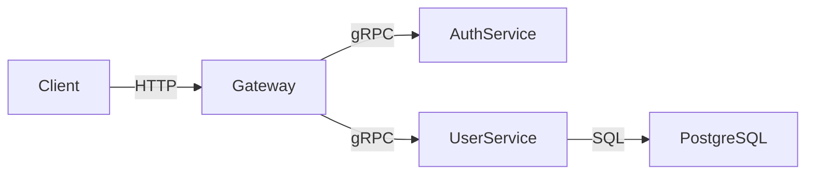

# AI 에이전트 기반 코드 문서화 자동화 워크플로우 — README부터 API 레퍼런스까지

> 코드는 계속 바뀌는데 문서는 그대로인 상황을 AI 에이전트로 해결하는 자동화 파이프라인

## 개요

새 기능을 PR로 머지할 때마다 README, API 레퍼런스, 아키텍처 다이어그램, 변경 로그가 저절로 최신 상태를 유지한다면 어떨까요.

이 워크플로우는 Claude Code 에이전트를 활용해서 코드 변경이 감지될 때마다 4가지 문서를 자동 갱신하는 파이프라인을 구성합니다. 수동으로 "문서 업데이트하는 걸 깜빡했다"는 상황을 없애는 게 목표입니다.

## 사전 준비

- Claude Code (또는 Gemini CLI, Codex CLI)
- GitHub Actions 또는 GitLab CI
- 프로젝트 루트에 `CLAUDE.md` 또는 `.cursorrules` 파일

## 단계별 설정

### Step 1: 문서화 전담 에이전트 설정

```markdown
# CLAUDE.md — 문서화 에이전트 전용 섹션

## 역할
이 세션은 코드베이스를 분석해 문서를 자동 생성하는 전용 에이전트입니다.

## 문서화 규칙
- 추측 금지 — 코드에서 읽은 내용만 작성
- 불확실한 부분은 `<!-- TODO: 확인 필요 -->` 태그 표시
- 기존 문서 구조와 톤을 유지
- 코드 예제는 실제 동작하는 것만 포함

## 작업 대상
1. README.md — 프로젝트 개요, 설치, 빠른 시작
2. docs/api-reference.md — 엔드포인트, 파라미터, 응답 예시
3. docs/architecture.md — 컴포넌트 구성, 의존성 흐름
4. CHANGELOG.md — 커밋 기반 변경 이력
```

### Step 2: 코드베이스 분석 스크립트

```bash
#!/bin/bash
# scripts/analyze-codebase.sh

# 1. 프로젝트 구조 스냅샷
find . -type f \
  -not -path './.git/*' \
  -not -path './node_modules/*' \
  -not -path './dist/*' \
  -not -path './__pycache__/*' \
  | sort > .tmp-structure.txt

# 2. 최근 변경 파일 감지 (최근 7일)
git log --since="7 days ago" --name-only --format="" \
  | grep -E '\.(ts|js|py|go|rs)$' \
  | sort -u > .tmp-changed-files.txt

# 3. API 엔드포인트 추출 (Express/FastAPI 기준)
grep -r "app\.\(get\|post\|put\|delete\|patch\)" src/ \
  --include="*.ts" --include="*.js" \
  -h 2>/dev/null | sort -u > .tmp-endpoints.txt

echo "분석 완료: $(wc -l < .tmp-changed-files.txt)개 변경 파일 감지"
```

### Step 3: README 자동 갱신

```bash
# Claude Code에 README 갱신 요청
claude --dangerously-skip-permissions << 'EOF'
다음 파일들을 읽고 README.md를 업데이트해:
- .tmp-structure.txt (프로젝트 구조)
- .tmp-changed-files.txt (최근 변경 파일)
- package.json 또는 pyproject.toml (프로젝트 메타데이터)

README 업데이트 기준:
1. 변경된 기능이 "사용 방법" 섹션에 반영되어 있는지 확인
2. 설치 방법이 최신 의존성 버전과 일치하는지 확인
3. 변경된 설정 옵션이 문서에 누락되지 않았는지 확인
4. 기존 내용은 최대한 유지하고, 필요한 부분만 추가·수정

기존 README.md 구조와 톤을 반드시 유지할 것.
EOF
```

### Step 4: API 레퍼런스 자동 생성

```bash
# Express/Fastify 기준 — TypeScript 타입에서 추출
claude << 'EOF'
src/routes/ 디렉토리의 라우터 파일들을 분석해서 docs/api-reference.md를 작성해:

각 엔드포인트마다 다음 포맷 사용:
---
### POST /api/users
**설명**: 신규 사용자 생성
**요청 본문**:
| 필드 | 타입 | 필수 | 설명 |
|------|------|------|------|
| email | string | ✅ | 사용자 이메일 |
**응답 예시**:
```json
{ "id": "usr_01", "email": "user@example.com" }
```
---

실제 코드에서 읽은 내용만 작성. 추측 금지.
EOF
```

### Step 5: 아키텍처 다이어그램 생성

Mermaid 형식으로 텍스트 기반 다이어그램을 자동 생성해 GitHub에서 바로 렌더링합니다.

```bash
claude << 'EOF'
이 프로젝트의 아키텍처를 분석해서 Mermaid 다이어그램으로 docs/architecture.md에 작성해:

포함 항목:
1. 컴포넌트 구성도 (graph LR 형식)
2. 주요 데이터 흐름 (sequenceDiagram 형식)
3. 데이터베이스 스키마 (erDiagram 형식, DB 사용 시)

예시:


실제 코드와 설정 파일에서 확인 가능한 연결만 표현할 것.
EOF
```

### Step 6: 변경 로그 자동화

```bash
# CHANGELOG.md 자동 업데이트
# conventional commits 형식 기준

LAST_TAG=$(git describe --tags --abbrev=0 2>/dev/null || echo "")
SINCE_ARG=""
[ -n "$LAST_TAG" ] && SINCE_ARG="$LAST_TAG..HEAD"

git log $SINCE_ARG \
  --pretty=format:"%h %s" \
  --no-merges \
  | grep -E "^[a-f0-9]+ (feat|fix|docs|refactor|perf|chore)" \
  > .tmp-commits.txt

claude << 'EOF'
.tmp-commits.txt 내용을 읽고 CHANGELOG.md 맨 위에 새 버전 섹션을 추가해:

포맷:
## [미정] — YYYY-MM-DD

### 신규
- feat 커밋 기반 항목들

### 수정
- fix 커밋 기반 항목들

### 개선
- refactor, perf 기반 항목들

커밋 해시는 제거하고, 사용자가 이해하기 쉬운 언어로 변환할 것.
EOF
```

## CI/CD 통합 (GitHub Actions)

```yaml
# .github/workflows/docs-sync.yml
name: AI 문서 자동 동기화

on:
  push:
    branches: [main]
    paths:
      - 'src/**'
      - 'packages/**'
      - 'package.json'

jobs:
  sync-docs:
    runs-on: ubuntu-latest
    permissions:
      contents: write
      pull-requests: write

    steps:
      - uses: actions/checkout@v4
        with:
          fetch-depth: 7  # 최근 7일 커밋 이력

      - name: Claude Code 설치
        run: npm install -g @anthropic-ai/claude-code

      - name: 코드베이스 분석
        run: bash scripts/analyze-codebase.sh

      - name: 문서 갱신 실행
        env:
          ANTHROPIC_API_KEY: ${{ secrets.ANTHROPIC_API_KEY }}
        run: |
          claude --dangerously-skip-permissions \
            "README.md, docs/api-reference.md, docs/architecture.md, CHANGELOG.md를 분석해서 최근 코드 변경사항을 반영해. 변경이 필요한 파일만 수정할 것."

      - name: 변경사항 PR 생성
        uses: peter-evans/create-pull-request@v6
        with:
          token: ${{ secrets.GITHUB_TOKEN }}
          branch: docs/auto-sync-${{ github.sha }}
          title: "docs: 코드 변경 반영 자동 문서 동기화"
          body: |
            코드 변경에 따른 문서 자동 동기화입니다.

            **변경 트리거**: ${{ github.event.head_commit.message }}
          labels: documentation,automated
```

## 문서 품질 검증

```bash
# scripts/validate-docs.sh
# 문서 갱신 후 기본 품질 체크

echo "=== README 체크 ==="
[ -f README.md ] || { echo "README.md 없음"; exit 1; }
grep -q "## 설치" README.md || echo "⚠️  설치 섹션 없음"
grep -q "## 사용 방법\|## 시작하기" README.md || echo "⚠️  사용 방법 섹션 없음"

echo "=== API 레퍼런스 체크 ==="
[ -f docs/api-reference.md ] && {
  ENDPOINT_COUNT=$(grep -c "^### " docs/api-reference.md)
  echo "✅ 엔드포인트 ${ENDPOINT_COUNT}개 문서화됨"
}

echo "=== Mermaid 다이어그램 체크 ==="
[ -f docs/architecture.md ] && {
  grep -q '```mermaid' docs/architecture.md \
    && echo "✅ 아키텍처 다이어그램 존재" \
    || echo "⚠️  Mermaid 다이어그램 없음"
}

echo "=== CHANGELOG 체크 ==="
[ -f CHANGELOG.md ] && {
  LAST_ENTRY=$(grep -m1 "^## " CHANGELOG.md)
  echo "✅ 최신 변경 로그: $LAST_ENTRY"
}
```

## 문서 유형별 갱신 빈도 설정

| 문서 | 갱신 트리거 | 자동화 가능 여부 |
|------|------------|-----------------|
| README.md | 주요 기능 변경, 의존성 업그레이드 | ✅ 완전 자동 |
| API 레퍼런스 | 라우터 파일 변경 | ✅ 완전 자동 |
| 아키텍처 다이어그램 | 서비스/DB 구조 변경 | ✅ 완전 자동 |
| CHANGELOG.md | 매 배포 | ✅ 완전 자동 |
| 튜토리얼 | 사용 흐름 변경 | 🔶 반자동 (AI 초안 + 사람 검수) |
| 개념 가이드 | 아키텍처 방향 변경 | 🔶 반자동 |

## 자주 발생하는 문제와 해결

| 문제 | 원인 | 해결 |
|------|------|------|
| 에이전트가 기존 내용을 통째로 바꿈 | 지시가 모호함 | CLAUDE.md에 "기존 구조 유지" 명시 |
| API 레퍼런스에 없는 엔드포인트가 생성됨 | 에이전트가 추측 | "코드에 없는 내용 작성 금지" 규칙 추가 |
| Mermaid 문법 오류 | 복잡한 관계 표현 | 단계별 다이어그램으로 분리 |
| CHANGELOG 항목 누락 | conventional commit 미준수 | PR 템플릿으로 커밋 형식 강제 |

## 다음 단계

→ [guides/80-spec-first-ai-workflow-guide.md](../guides/80-spec-first-ai-workflow-guide.md) — 코드 전에 설계 문서를 먼저 작성하는 스펙 퍼스트 접근

→ [claude-code/playbooks/54-prompt-version-control.md](../claude-code/playbooks/54-prompt-version-control.md) — 문서화 프롬프트도 버전 관리하기

---

**더 자세한 가이드:** [claude-code/playbooks](../claude-code/playbooks/)

**뉴스레터:** [maily.so/tenbuilder](https://maily.so/tenbuilder)
